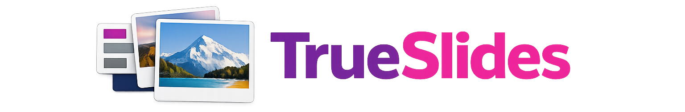
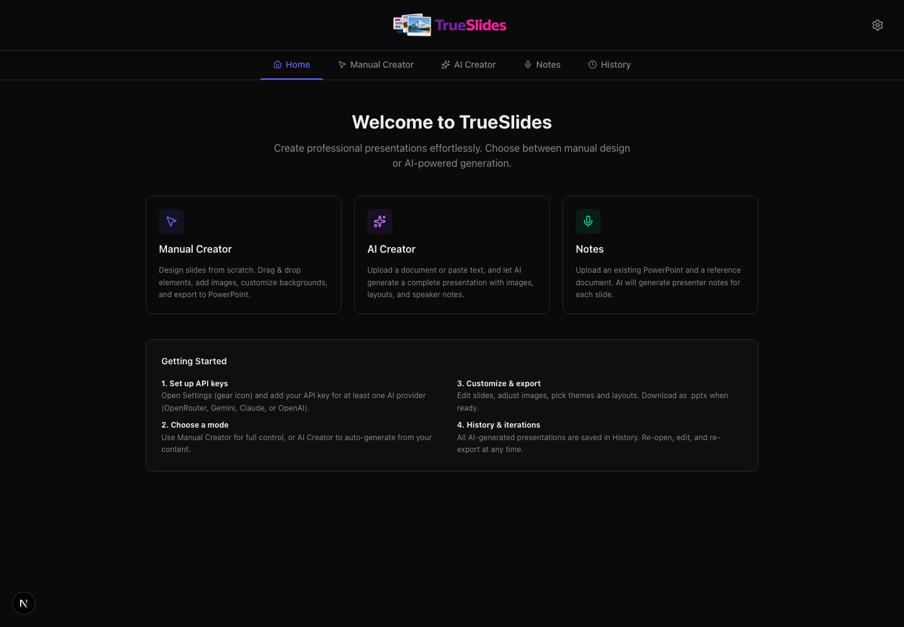
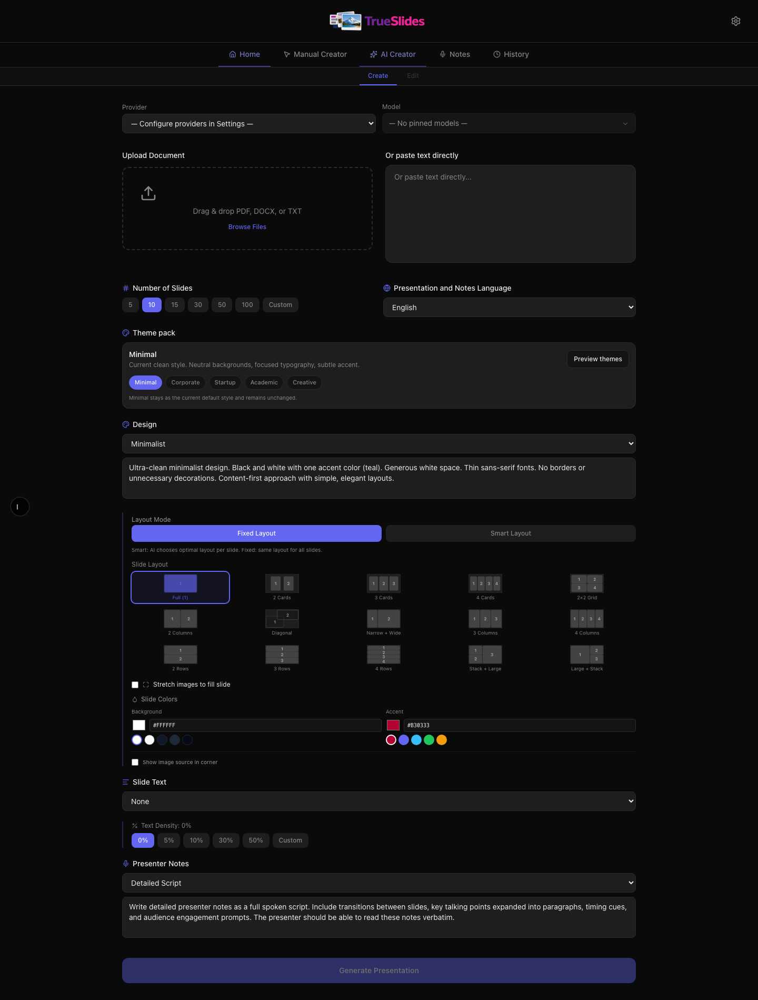
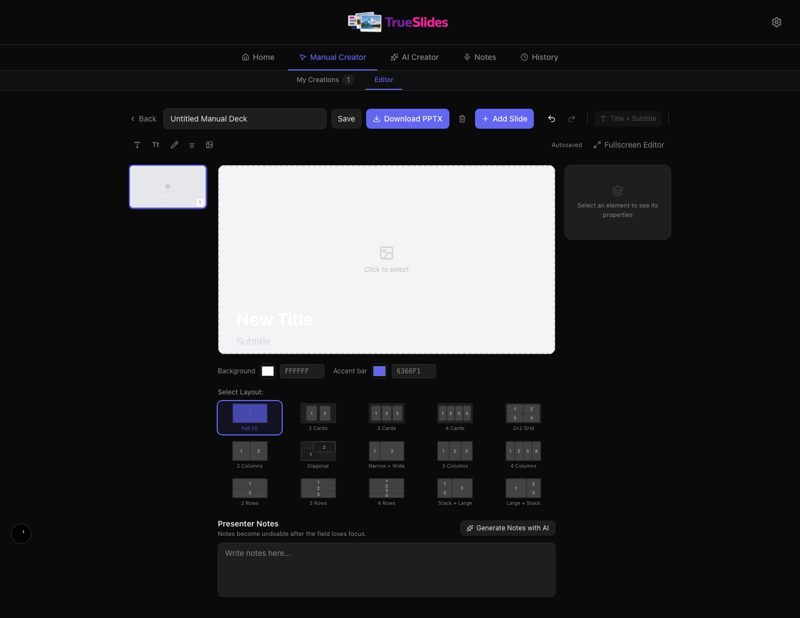
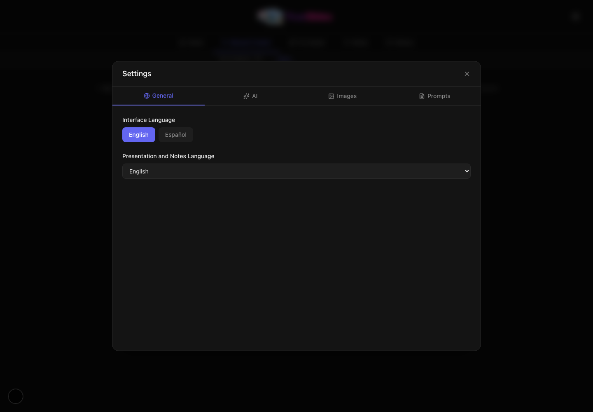

<p align="center">
  
</p>

<p align="center">
  Automatically build presentation decks grounded on real images (not AI generated), edit them manually, or generate speaker notes from an existing PowerPoint or document.
</p>

## Overview

TrueSlides is a Next.js application for creating and refining presentation decks.

It includes three main workflows:

- AI Creator for generating slides from source text or uploaded documents
- Manual Creator for building slides from scratch with a visual editor
- Notes Generator for creating speaker notes from an existing `.pptx` and reference material

The app also includes background job tracking, history, image search across multiple sources, PowerPoint and PDF export, and encrypted server-side key storage.

## Screenshots

| Home | AI Creator |
| --- | --- |
|  |  |

| Manual Creator | Settings |
| --- | --- |
|  |  |

## Features

### Creation modes

- Home dashboard with clear entry points for each workflow
- AI Creator with document upload, prompt controls, theme packs, slide layouts, text density, and export options
- Manual Creator with drag-and-drop elements, image slots, color controls, layout switching, presenter notes, and PPTX export
- Notes Generator for producing speaker notes in the background from an existing PowerPoint and supporting document
- History view for reopening generated work, tracking job status, and iterating on previous outputs

### Editing and output

- Slide editing with AI-assisted update flows
- Manual canvas editing with resize, reposition, alignment, layering, and image crop/pan controls
- PPTX export for generated and manual presentations
- PDF export from the live web slide views
- Plain text notes export
- English and Spanish interface support

### Security and storage

- AI and image-source keys are stored server-side only
- Keys are encrypted with AES-256-GCM using `ENCRYPTION_KEY`
- Session state is stored with HTTP-only cookies
- Local app data is persisted under `data/`

## Integrations

### AI providers

- OpenRouter
- Google Gemini
- Anthropic Claude
- OpenAI

### Image sources

No API key required:

- Wikimedia Commons
- Openverse
- Library of Congress

Optional API key support:

- Unsplash
- Pexels
- Pixabay
- Flickr
- Europeana
- Hispana

### File formats

Input formats:

- `.pdf`, `.docx`, `.txt` for AI slide generation
- `.pptx` plus `.pdf`, `.docx`, or `.txt` for notes generation

Output formats:

- `.pptx`
- `.pdf`
- `.txt` notes export

## Requirements

- Node.js 18 or newer
- npm 9 or newer
- An API key for at least one supported AI provider
- `ENCRYPTION_KEY` configured before storing any provider or image-source keys

## Quick Start

### 1. Install dependencies

```bash
npm install
```

### 2. Configure the environment

Copy the example file and set an encryption key:

```bash
cp .env.example .env
openssl rand -hex 32
```

Then paste the generated value into:

```env
ENCRYPTION_KEY=your_generated_key_here
```

`ENCRYPTION_KEY` is required for encrypted key storage in `data/keys.json`.

### 3. Start the app

```bash
npm run dev
```

Open `http://localhost:3000` in your browser. If port `3000` is already in use, Next.js will automatically choose the next available port.

### 4. Configure providers in the UI

1. Open **Settings** from the header.
2. Add an API key for at least one AI provider.
3. Optionally add keys for any image sources you want to enable.
4. Load models and choose the model you want to use.

## Ways to Run the App

### Development

Use this for day-to-day work:

```bash
npm install
npm run dev
```

### Local production build

Use this to verify the production build locally:

```bash
npm install
npm run build
npm run start
```

### Docker Compose

This uses the included `docker-compose.yml` and exposes the app on port `5959`:

```bash
cp .env.example .env
# set ENCRYPTION_KEY in .env
docker compose up --build
```

Open `http://localhost:5959`.

### Docker

Use the included `Dockerfile` directly:

```bash
docker build -t trueslides .
docker run --rm -p 3000:3000 --env-file .env trueslides
```

## Common Workflows

### Generate a deck with AI

1. Open **AI Creator**.
2. Upload a source document or paste text directly.
3. Choose provider, model, theme pack, slide count, layout mode, and prompts.
4. Generate the presentation.
5. Review the result in the editor or reopen it later from **History**.
6. Export as PowerPoint, PDF, or notes text where applicable.

### Build a deck manually

1. Open **Manual Creator**.
2. Create a new deck.
3. Add slides and choose layouts.
4. Add titles, subtitles, text blocks, bullets, and image elements.
5. Adjust element positions, colors, notes, and layout details.
6. Export the result as `.pptx`.

### Generate speaker notes from an existing PowerPoint

1. Open **Notes**.
2. Upload a `.pptx` file.
3. Upload a supporting `.pdf`, `.docx`, or `.txt` document.
4. Choose provider, model, language, and notes prompt.
5. Start generation and monitor progress in **History**.

## Testing

Run the full test suite:

```bash
npm test
```

Run coverage:

```bash
npm run test:coverage
```

Run a single test file:

```bash
npx jest __tests__/components/components.test.tsx
```

## Tech Stack

- Next.js 15
- React 19
- TypeScript 5
- Tailwind CSS 4
- Zustand 5
- PptxGenJS 4
- Jest and Testing Library

## Project Notes

- Encrypted keys are stored in `data/keys.json`.
- App state is persisted in `data/state.json`.
- The image system can combine multiple sources and rank them differently depending on the topic.
- Historical topics are biased toward archival sources such as Wikimedia Commons, Library of Congress, and Europeana when available.
